# pet-adoption-site

🐾 Pet Adoption Website
It is my first site that include every feature required for a basic website. This is my project in first year. I have deployed this site on pythonanywhere.com and you can take a look to it. 

https://sourabhbansal.pythonanywhere.com/

The site is completly responsive for mobile phone and desktops.

 A full-featured pet adoption platform built with Django, allowing users to view adoptable pets, submit adoption requests, manage blog posts, and handle contact/letter submissions. It includes role-based access with Superadmin and Staff Admin views.

Home page
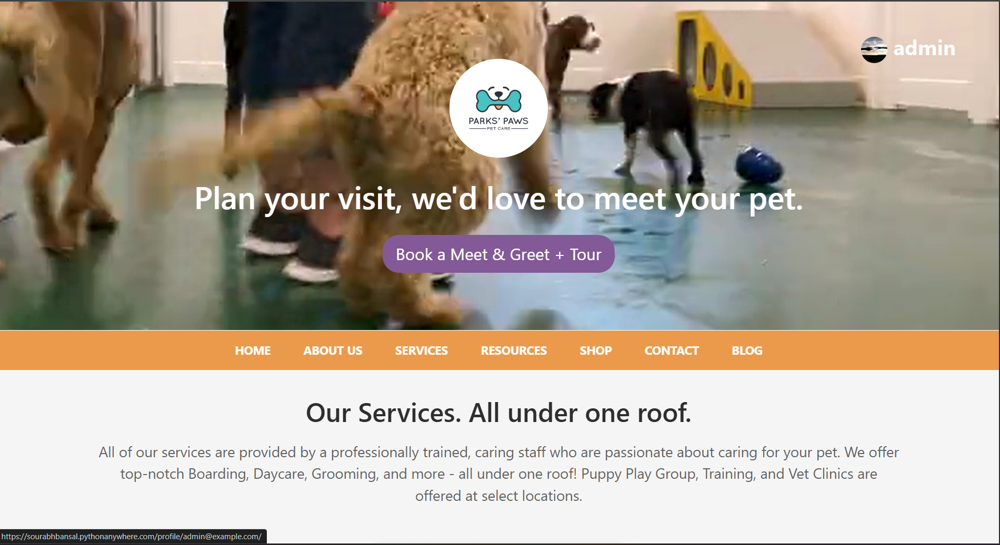

Contact us page 
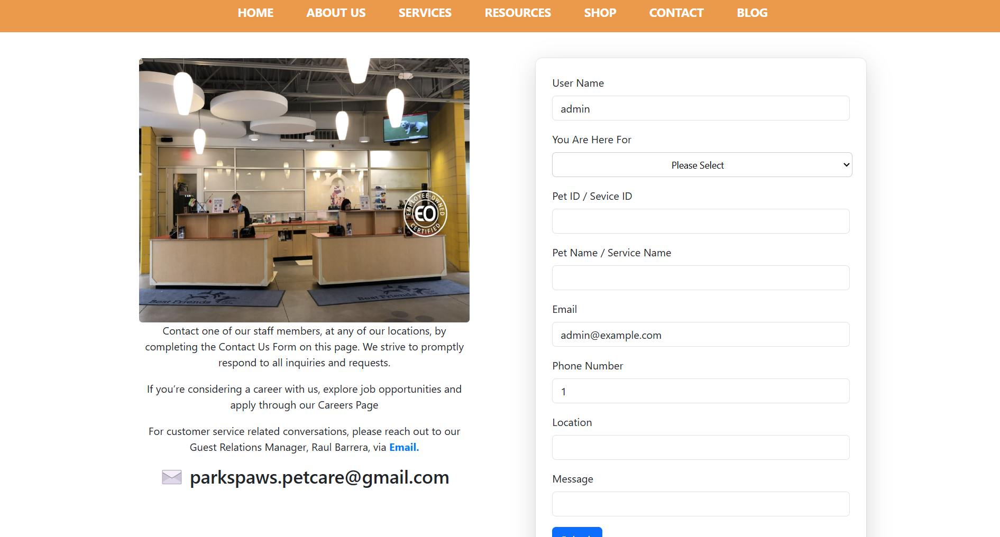
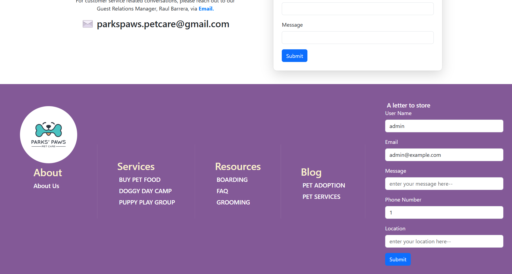

profile page 
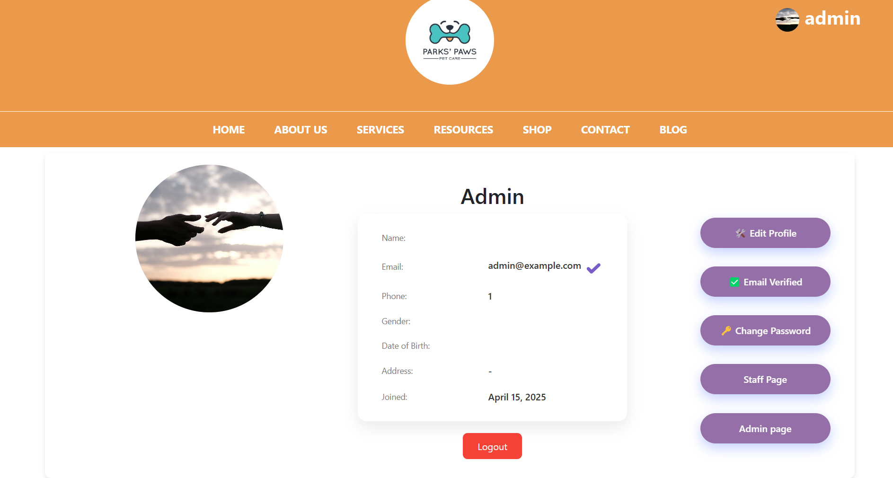
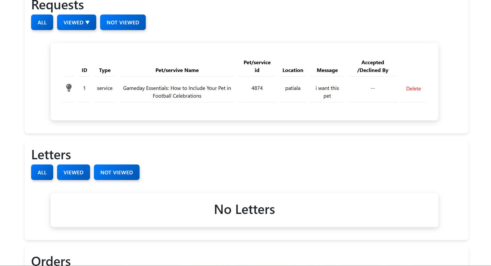
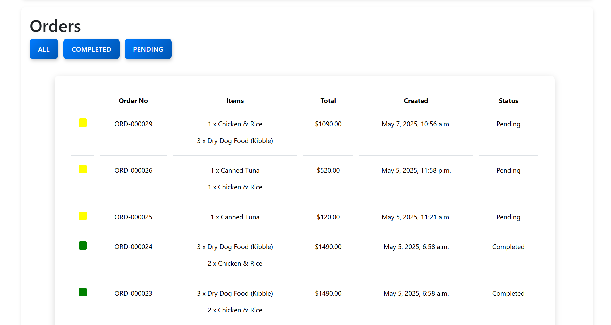

Blog page 
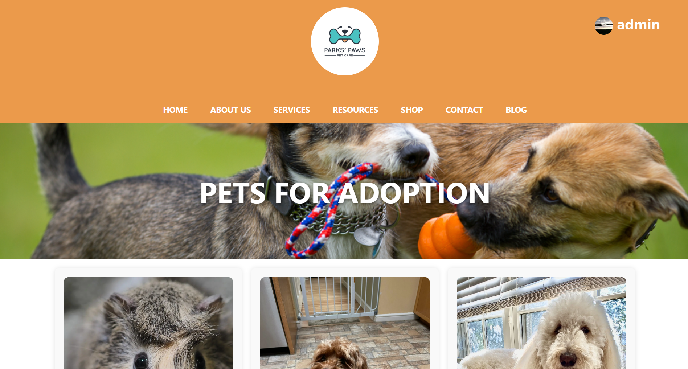
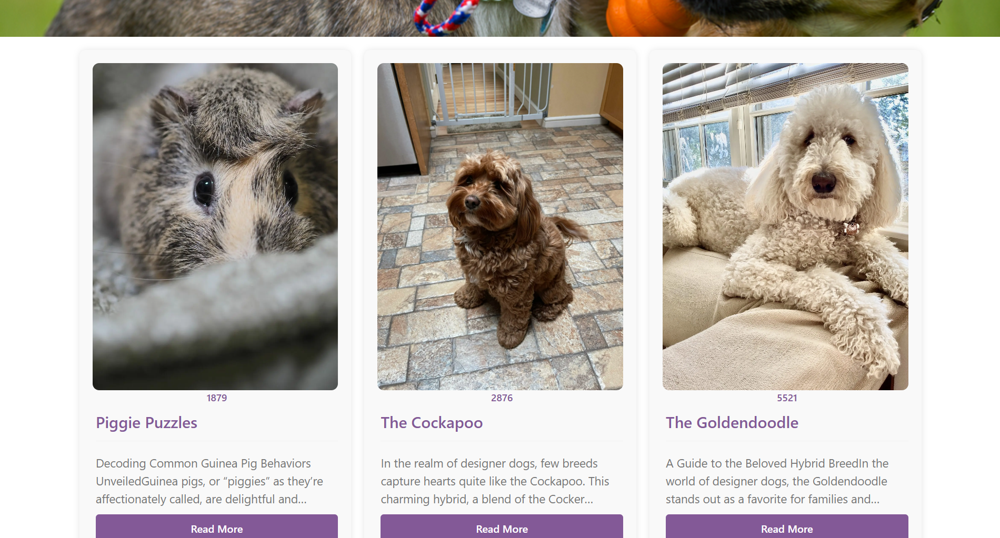

Shop 
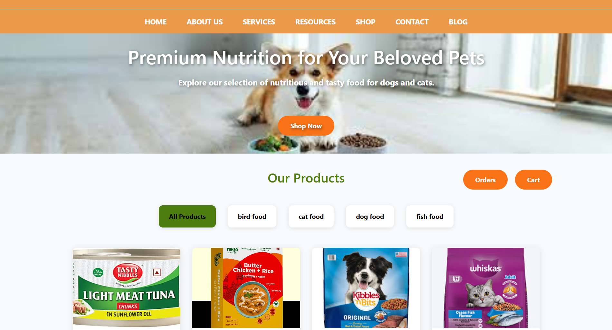
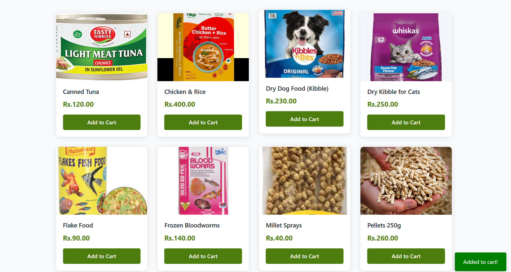   

my cart
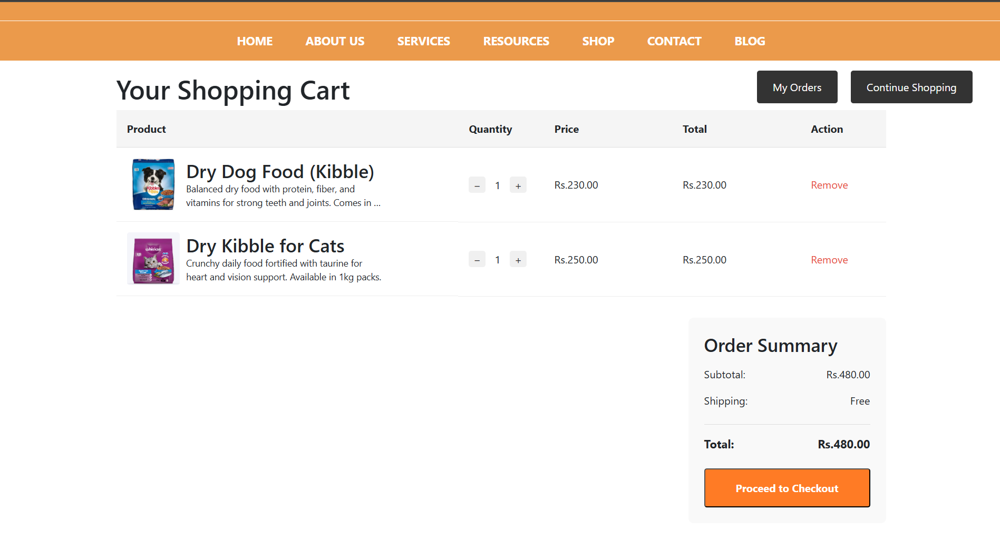

after checkout 
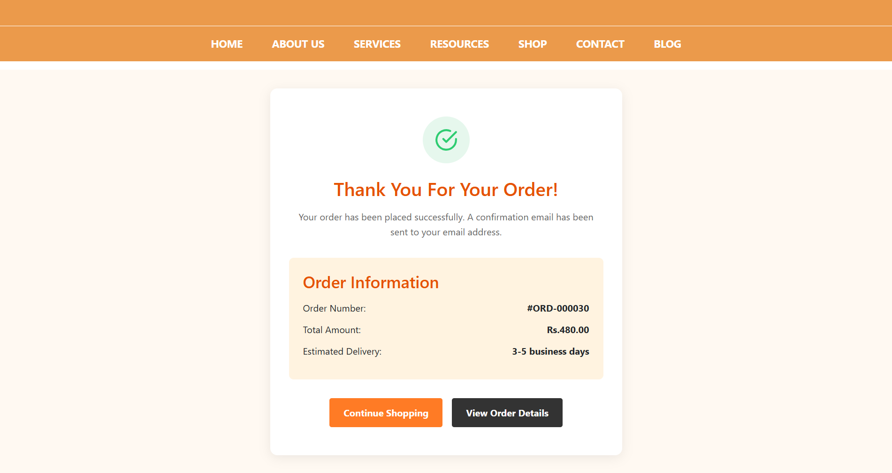

my orders
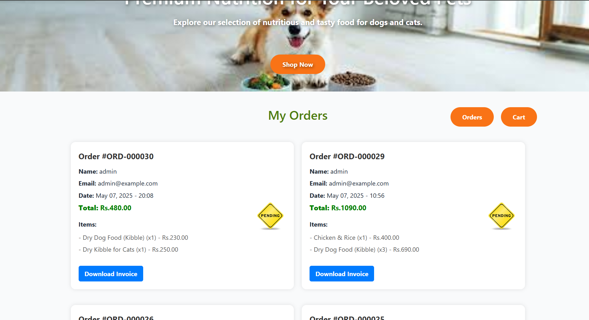

invoice pdf 
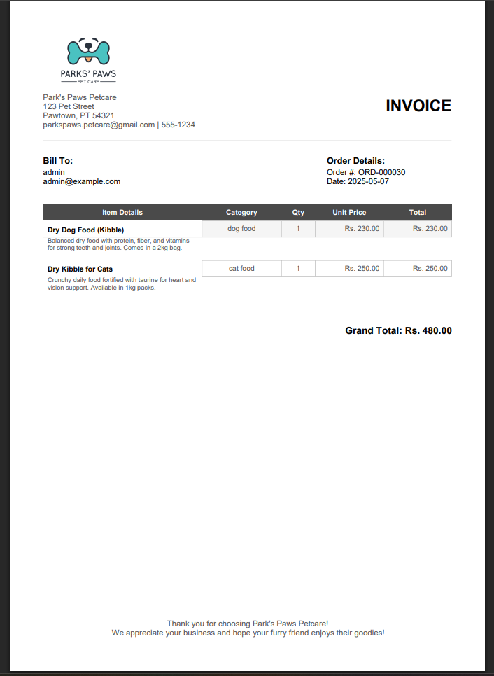

email after checkout

admin pannel
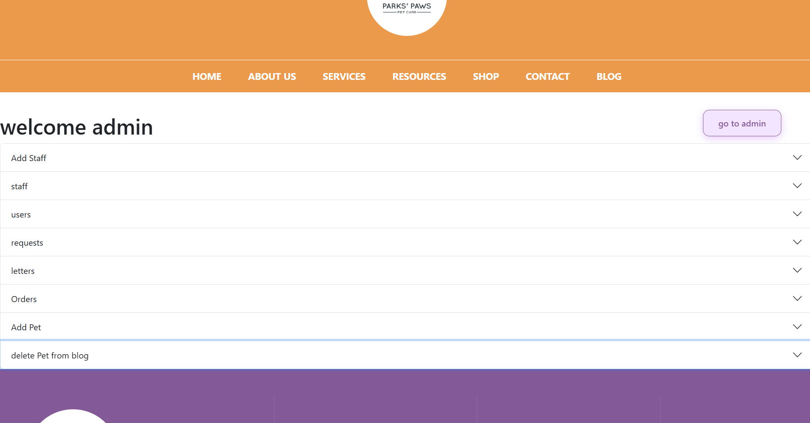
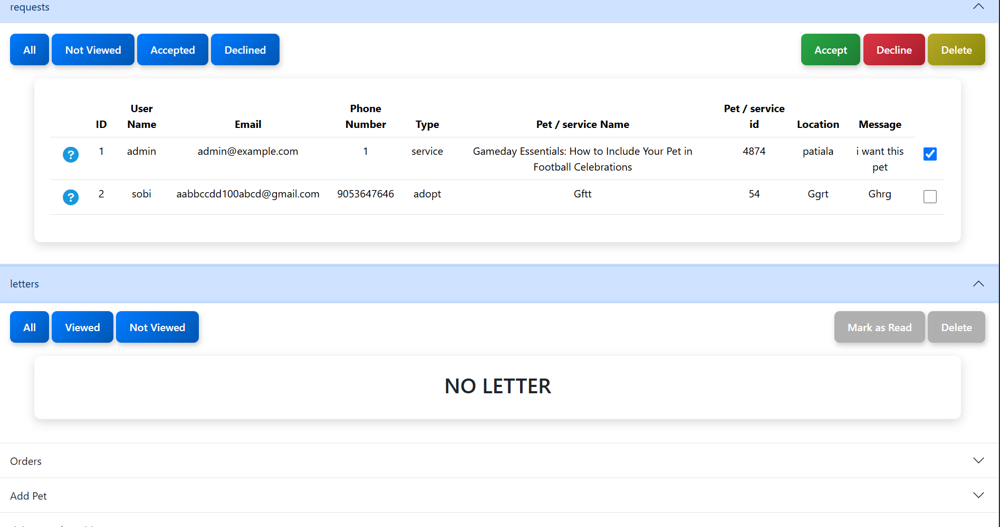
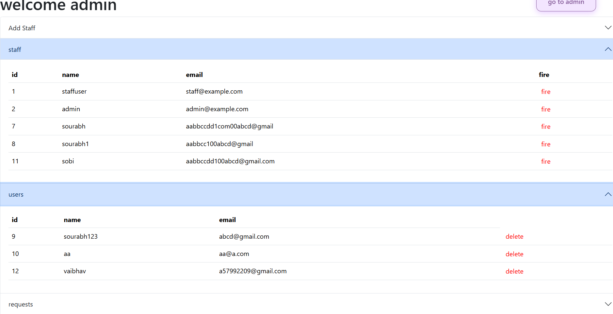
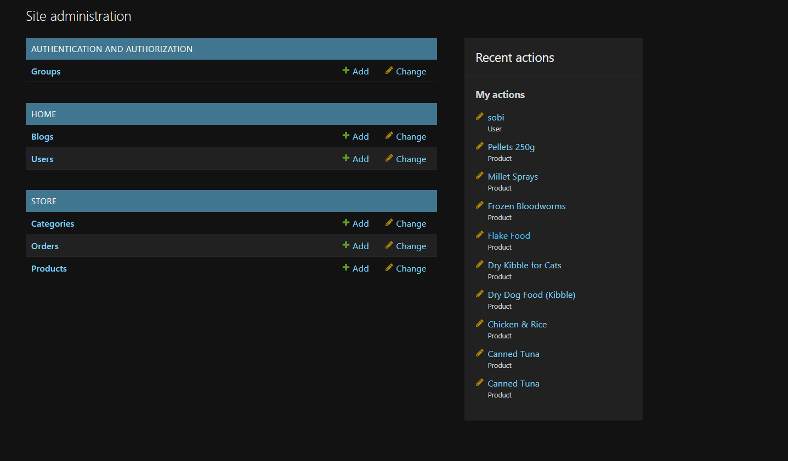

🚀 Setup Instructions
bash
Copy
Edit
https://github.com/sourabhbansal111/pet-adoption-site.git
cd petadoption
python -m venv venv
source venv/bin/activate  # On Windows: venv\Scripts\activate
pip install -r requirements.txt
python manage.py migrate
python manage.py runserver
📁 Folder Structure
csharp
Copy
Edit
petadoption/
│
├── home/                 # Main Django app
├── static/
│   └── images/
│       └── uploads/      # Uploaded pet/blog images
│       └── screenshots/  # Screenshots for README
├── templates/
│   └── home/
│       └── *.html        # All HTML templates
├── manage.py
└── README.md
📌 Technologies Used

Django

SQLite (default)

HTML/CSS (Internal styling)

Bootstrap (optional, minimal)

Email backend (for OTP)

JavaScript (minimal or none, based on use)

Let me know if you want me to generate placeholder screenshots for each section or help you format them in your actual project folder. Would you like me to do that?
